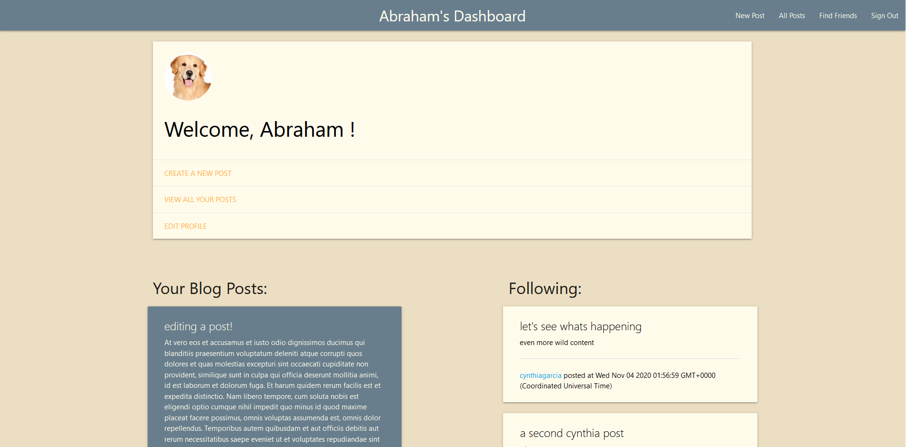

# UTA-FSF Project 2 - "It's a Blog's Life" 
 
  
 
 
 
   
 
  

A full-stack weblog app built on NodeJS using express-sequelize, handlebars, Passport, and ESLint.  
Share your thoughts, find new friends, and give feedback to other's content in the form of comments and likes!

### This repository contains the code files for the 2nd project assignment for the UT-Austin Coding Bootcamp.

---

## Table of Contents

* [Installation](#Installation)  
* [Contribution](#Contribution)  
* [Project Assignment](#Project-Assignment)  
* [User Story](#It's-a-Blog's-Life)  
* [Link to Deployed Application](#Link-to-Deployed-Application)  
* [Usage](#Usage)  
* [Example](#Example)  
* [Contents](#Contents)  
* [Team](#Author)  
* [License](#License)  
* [Credits](#Credits)  
  
 ---
 
 
## Installation

Feel free to [clone the repo](https://github.com/Cenzo-cmd/Project-2) and run locally by using the terminal/bash command `node server`

## Contribution

Please contact any of the team members below if you find an issue or have a suggestion for future development!
 
## Project Assignment

- Design an app using the MVC paradigm and a home-made server-side API
- Focus on code quality, emphasizing and enforcing Javascript linting and continuous integration via TravisCI
- Build and deploy a full-stack web application using Heroku and JawsDB database  
- Practice applied agile software development, git branching work flow, and professional presentation  

## It's a Blog's Life

>AS an opinionated expert  
>I WANT a platform to publish my thoughts  
>SO I can share them with others  

>AS a blog user  
>I WANT to connect to others on my platform  
>SO they can share their thoughts with me  

>AS a blog user  
>I WANT the ability to provide feedback  
>SO other users know how I feel about their content  

---

## Link to Deployed Application

https://its-a-blogs-life.herokuapp.com/

## Usage 

Just visit  on Heroku and sign up to begin!  
  
All users on the site have visibility to all other users. Create new posts or edit existing ones, see other users' profiles and their posts, and provide "likes" and comments!  

You can even "Follow" another user to show their posts on your feed!

---

## Examples

placeholders

---

## Contents
**Files include:**
* Configuration files incl. Sequelize, Passport, Heroku/JawsDB, MySQL2
* Models: Blog Objects
* Client-side styling and scripting
* Controllers - API and HTML Engpoints
* Views - handlebars client-side layouts and templates
* ESLint Configuration
* Travis CI Configuration
* NPM Configuration
* Server Configuration
* License
* Sample Screenshot of App 
* This README file

---

## Team
[Vincent Doria](https://github.com/Cenzo-cmd)  
[Cynthia Garcia](https://github.com/caersun)  
[Ryan Rotmam](https://github.com/ryanrotman)  
[Abraham Spindel](https://github.com/abraspin)

---

## License

---

## Credits
* JQuery [MIT license](https://jquery.org/license/)   
* MaterializeCSS Library [MIT license](https://github.com/Dogfalo/materialize/blob/master/LICENSE)    
* Node.js Project [MIT license](https://raw.githubusercontent.com/nodejs/node/master/LICENSE)   
* ExpressJS [MIT license](https://github.com/expressjs/express/blob/HEAD/LICENSE)   
* MySQL [MIT license](https://github.com/mysqljs/mysql/blob/master/License)  
* PassportJS [MIT license](https://github.com/jaredhanson/passport/blob/master/LICENSE)  
* BCrypt [Apache license]( https://github.com/patrickfav/bcrypt/blob/master/LICENSE) 
* HandlebarsJS [MIT license]( https://github.com/handlebars-lang/handlebars.js/blob/master/LICENSE) 
* Node Package Manager (npm) [Artistic License 2.0](https://www.npmjs.com/policies/npm-license)  
* [Gravatar](http://en.gravatar.com/) GLobally Recognized Avatar
* ESLint [MIT license](https://github.com/eslint/eslint/blob/master/LICENSE)
* Sequelize [MIT license](https://github.com/sequelize/sequelize/blob/master/LICENSE)

